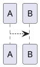

# plantuml-template

Edit PlantUML images in VS Code with live previews.

## Step 1: Clone this repo

```
git clone https://github.com/svdarren/plantuml-template.git
cd plantuml-template
```

## Step 2: Start PlantUML with Docker

The compose file will start the Jetty-based PlantUML container and publish port 9147.
```
docker compose up
```

## Step 3: Launch VS Code

```
code .
```
When prompted to install recommended extensions, install the PlantUML extension.  The `settings.json` file has been configured for `http://localhost:9147`.

## Step 4: Open the Markdown Preview

There are now several options in the VS Code command palette:

* The native 'Markdown: Open Preview' or 'Markdown: Open Preview to the Side' now render PlantUML inside the Markdown file.
* 'PlantUML: Preview Current Diagram' renders one diagram at a time.

## Step 5: Create PlantUML diagrams

The plugin recognizes files with the *.wsd, *.pu, *.puml, *.plantuml, *.iuml extensions.

Additionally, you can embed diagrams in Markdown, like this example below.  Note that the Markdown image won't render in other locations without render support, but you could export the image publishing.

