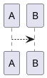

# plantuml-template

Edit PlantUML images in VS Code with live previews.

## Step 1: Clone this repo

```
git clone https://github.com/svdarren/plantuml-template.git
cd plantuml-template
```

## Step 2: Start PlantUML with Docker

The compose file will start the Jetty-based PlantUML container and publish port 9147.
```
docker compose up -d
```

## Step 3: Launch VS Code

Open this directory in VS Code.  The command below will open the directory as a workspace, and also open this README.md file.
```
code . README.md
```
When prompted to install recommended extensions, install the PlantUML extension.  The `settings.json` file has been configured for the PlantUML server running at `http://localhost:9147`.

## Step 4: Open the Markdown Preview

### Native Markdown preview

The native Markdown Preview now render PlantUML inside the Markdown file.

* Open the Markdown preview by...
    * Pressing the small icon in the top right.  It's a magnifying lens over two pages.
    * Opening the command palette and searching for 'Markdown: Open Preview' or 'Markdown: Open Preview to the Side'
    * Pressing the keyboard shortcut (check the command palette for your OS'es shortcut)
* By default the content will be disabled, so press the blue button 'Some content has been disabled in this document' and enable at least 'Allow insecure local content'.



### Plugin preview

Additionally, the plugin adds 'PlantUML: Preview Current Diagram' to the command palette.  This option renders one diagram at a time and is useful while writing the diagram.

## Step 5: Create PlantUML diagrams

The plugin recognizes files with the *.wsd, *.pu, *.puml, *.plantuml, *.iuml extensions.

Additionally, you can embed diagrams in Markdown, like this example below.  Note that the Markdown image won't render in other locations without render support, but you could export the image publishing.

